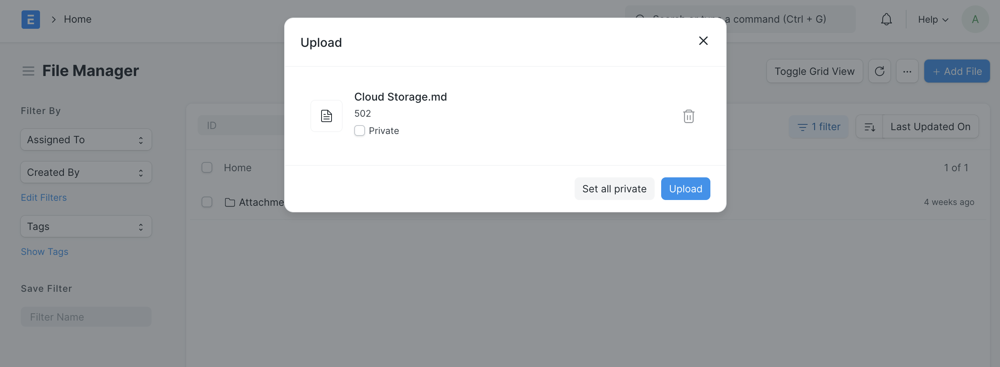
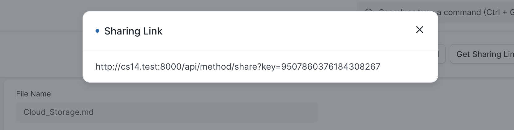
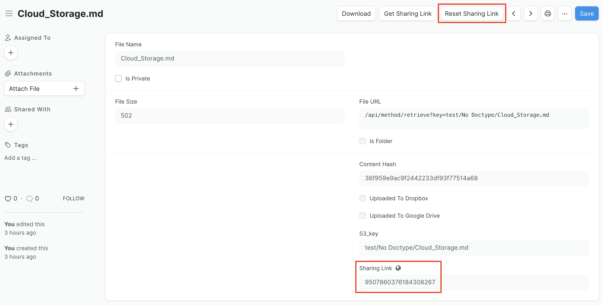
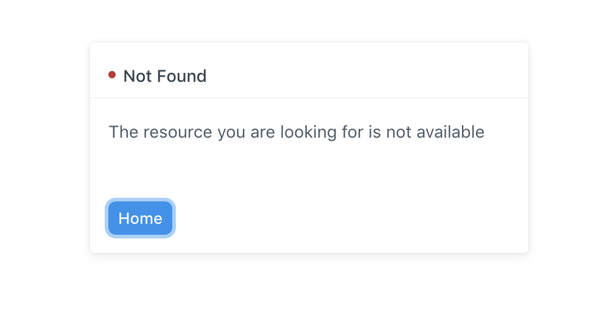

# Cloud Storage Documentation

Cloud Storage extends the file utilities in a Frappe App to integrate with third-party cloud storage applications. Once configured, users can upload, download, or remove files to a cloud storage application via the Frappe App's interface. Depending on user permissions, they may also generate or reset sharing links to files.

Cloud Storage can be configured to work with a variety of cloud storage providers, including Amazon Web Services S3, DigitalOcean Spaces, and Backblaze B2.

See the following pages for detailed instructions on Cloud Storage installation and configuration:

- [Cloud Storage Developer Environment Installation](./development.md)
- [Cloud Storage Production Environment Installation](./production.md)
- [Cloud Storage Configuration](./configuration.md)

## Cloud Storage Quick Start

Once the Cloud Storage application is installed and configured, search for "File List" in the AwesomeBar. To upload a file, click the "+ Add File" button, load a file, and click "Upload". This action automatically adds the file to the configured third-party cloud storage application.

The page for the uploaded file includes several features. There's a button to "Download" the file from the cloud storage service, which will open a new browser window to the file's contents.

There's also a "Get Sharing Link" button that allows for a user to create a sharing link to the file for unauthenticated users. This only works if the user has permission to "Share" on File documents.

The full link will appear in a dialogue box, and the link key saves to a "Sharing Link" field in the document. The link may be accessed any number of times again via the "Get Sharing Link" button.

After a user generates a sharing link, they'll see a new "Reset Sharing Link" button. They can revoke the current sharing link by using the button to generate a new sharing link.

Users may delete files as long as the file is not attached to a submitted document. When they delete a file in the Frappe interface, it is also removed from the cloud storage application.

If a user tries to access a file that's been deleted or clicks on the old version of a sharing link that's been reset, they will see the following error page.

